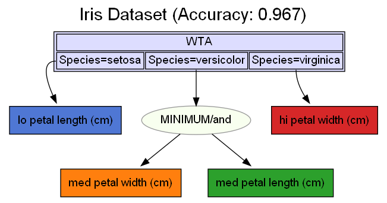
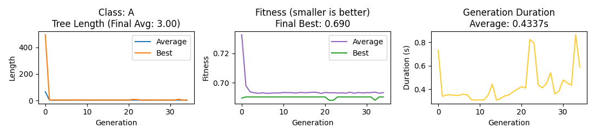
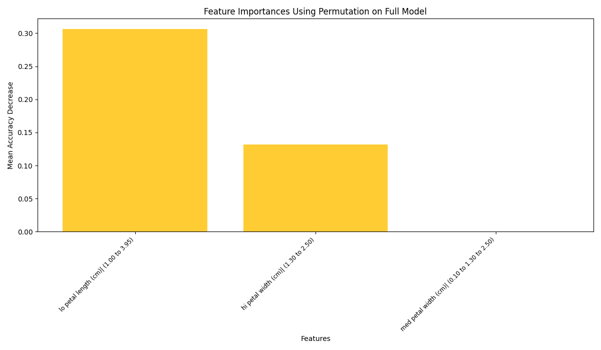
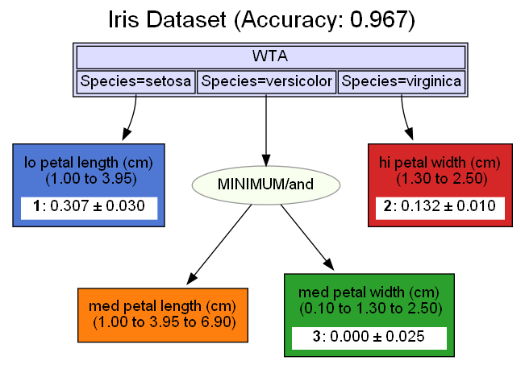
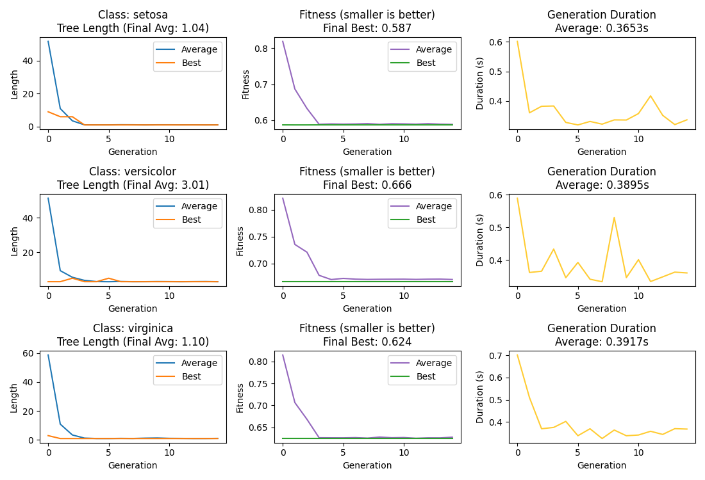
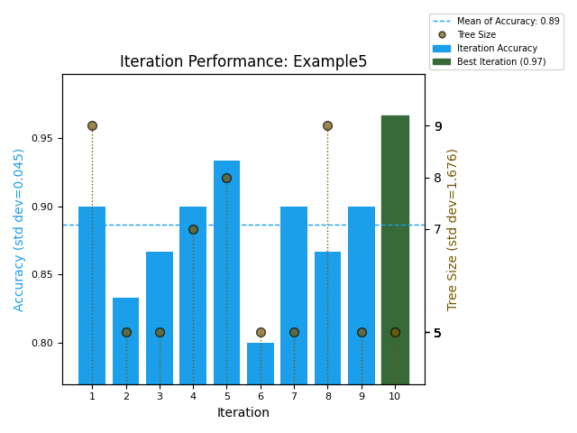

Sample Programs
===============

These examples provide an introduction to the Zuffy package and show some
ideas of how it can be used to explore a dataset.

Example 1 - Minimal
-------------------

This is a very basic implementation using the sci-kit learn Iris dataset.  The program
runs a number of  experiments (iterations) where it generates a Fuzzy Pattern Tree on a training
subset of the Iris data and it selects the best performing model from those experiments.

It graphs the tree showing the three classes of Iris with a Winner-Take-All root.  This
simplest of FPTs shows that if the plant has a low length of petal it is likely to be of
the Setosa species.  If the petal width is medium sized and the length is also medium
sized then the species is Versicolor and if the petal width is high (i.e. long) then 
the species is Virginica.

.. literalinclude:: ../../examples/example1.py
    :language: python
    :linenos:

Example 2 - Categoricals
------------------------

This example uses a dataset with both numeric and categorical features.

.. literalinclude:: ../../examples/example2.py
    :language: python
    :linenos:

Example 3 - GridSearchCV
------------------------

The sci-kit learn package includes the GridSearchCV feature that allows
a developer to specify a range of hyperparameters when building their model.
This is supported by Zuffy.

.. literalinclude:: ../../examples/example3.py
    :language: python
    :linenos:

Example 4 - Pipeline
--------------------

Because it is scikit-learn compatible, the Zuffy classifier and Fuzzy transformer
can be included in pipelines to help manage more complex model generation.

.. literalinclude:: ../../examples/example4.py
    :language: python
    :linenos:

Example 5 - Full Visuals
------------------------

The Zuffy visuals module includes four plots to facilitates visualisation 
of the induction process and the performance across multiple experiments.

.. literalinclude:: ../../examples/example5.py
    :language: python
    :linenos:

This plot shows the relative importance of key features in the dataset.

This FPT includes the feature range and a measure of their importance.

This plot shows the evolution metrics for each class in the best FPT.

Each of the experiments can be graphed using the plot_iteration_performance function.
The graph shows the result of each experiment with the accuracy on the left axis and 
the tree size on the right.

